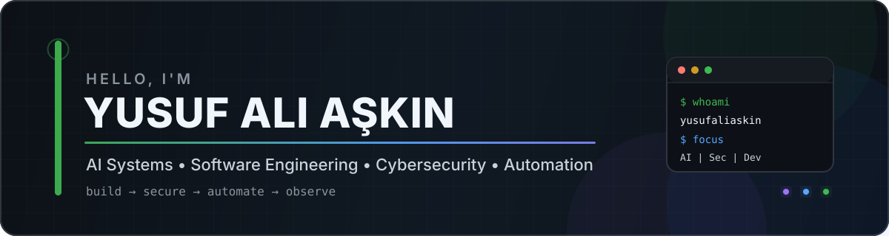

  

  <b>English</b> · <a href="README_TR.md">Türkçe</a>

### 👾 About Me

&nbsp;&nbsp;&nbsp; 🤖 &nbsp;I build AI systems, automation tools and developer-focused software.  
&nbsp;&nbsp;&nbsp; 🛡️ &nbsp;I work on cybersecurity, SIEM, identity/session monitoring and observability systems.  
&nbsp;&nbsp;&nbsp; 🧩 &nbsp;I enjoy designing products across backend, frontend, systems and infrastructure layers.  
&nbsp;&nbsp;&nbsp; 🐧 &nbsp;I work with Linux, networking, Active Directory, Wazuh and operational automation.  
&nbsp;&nbsp;&nbsp; ⚡ &nbsp;My focus is automating repetitive work, simplifying complex systems and building production-oriented solutions.

  
  
  

---

  
<b>💻 Main Tech Knowledge</b>

   

**Languages**  

**Web & Backend**  

**AI & Data**  

**Systems, Security & Observability**  

  
<b>🧠 Other Knowledge & Areas I Keep Exploring</b>

   

`AI Agents` · `LLM Applications` · `RAG` · `Automation` · `SOC Tooling` · `SIEM` · `Identity Monitoring` · `Networking` · `DevOps` · `Observability` · `Secure Software Design` · `System Administration`

  
<b>🚀 Featured Projects</b>

   

| Project | Focus | Technologies |
|---|---|---|
| [ZKSessions](https://github.com/yusufaliaskin/ZKSessions) | Windows/Wazuh session intelligence and SOC operations | Django, DRF, Celery, Redis, Wazuh |
| [F.R.I.D.A.Y-AI](https://github.com/yusufaliaskin/F.R.I.D.A.Y-AI) | Local AI operating-system assistant | Python, AI automation |
| [AIStudio](https://github.com/yusufaliaskin/AIStudio) | Multi-model conversational AI platform | Flask, OpenAI, Gemini, Claude, Supabase |
| [yusufaliaskin.com](https://github.com/yusufaliaskin/yusufaliaskin.com) | Personal portfolio and project showcase | HTML, CSS, JavaScript |
| [IT-Toolbox-Global](https://github.com/yusufaliaskin/IT-Toolbox-Global) | IT and system utilities | Automation, system tooling |

  
<b>📊 GitHub Statistics</b>

   

  
  

  
  

  

---

  Building software that automates work, strengthens systems and turns complexity into usable tools.

  

