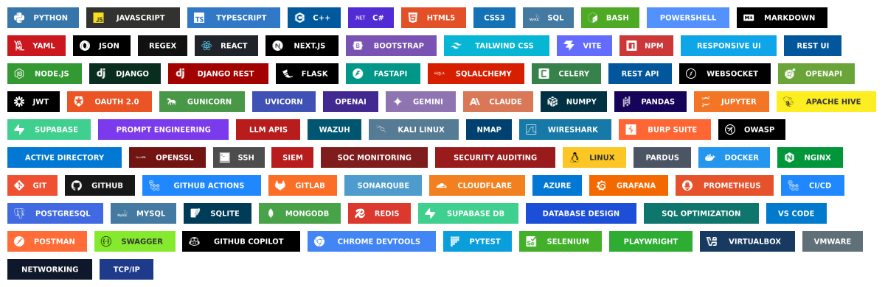
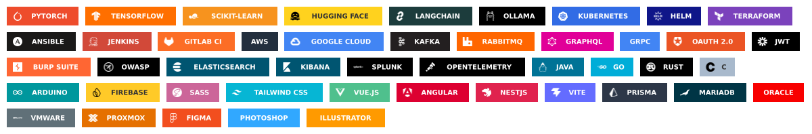
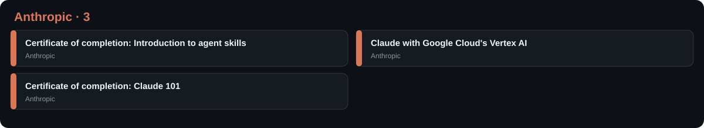
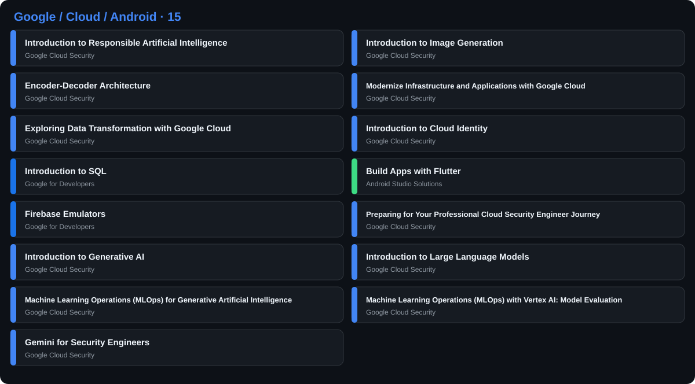
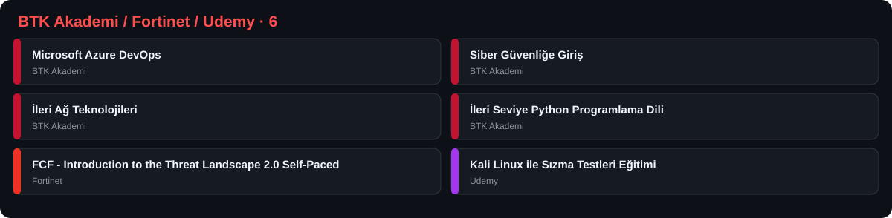
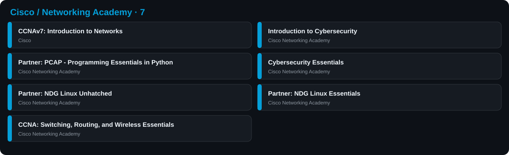

</img>

<table align="right">
 <tr><td><a href="README.md"> English</a></td></tr>
 <tr><td><a href="README_TR.md"> Türkçe</a></td></tr>
 <tr><td><a href="README_DE.md"> Deutsch</a></td></tr>
 <tr><td><a href="README_RU.md"> Русский</a></td></tr>
 <tr><td><a href="README_ZH.md"> 中文</a></td></tr>
</table>

### :space_invader: &nbsp;Hakkımda

&nbsp;&nbsp;&nbsp; :technologist: &nbsp;**AI, siber güvenlik, otomasyon ve modern yazılım sistemleri** odaklı Software Engineer.\
&nbsp;&nbsp;&nbsp; :seedling: &nbsp;**Backend, altyapı, izleme ve akıllı uygulamalar** geliştirmeyi seviyorum.\
&nbsp;&nbsp;&nbsp; :heartbeat: &nbsp;Sürekli öğrenmeye, otomasyona ve sistemleri iyileştirmeye odaklanıyorum.

  &nbsp;&nbsp;&nbsp;&nbsp;
  &nbsp;&nbsp;&nbsp;&nbsp;
  &nbsp;&nbsp;&nbsp;&nbsp;
  &nbsp;&nbsp;&nbsp;&nbsp;
  

  <picture>
    <source media="(prefers-color-scheme: dark)" srcset="https://raw.githubusercontent.com/yusufaliaskin/yusufaliaskin/output/github-contribution-grid-snake-dark.svg" />
    <source media="(prefers-color-scheme: light)" srcset="https://raw.githubusercontent.com/yusufaliaskin/yusufaliaskin/output/github-contribution-grid-snake.svg" />
    
  </picture>

  
<b>:computer: &nbsp;Ana teknoloji bilgim</b>

   

<strong>⌨️ Diller & İşaretleme</strong>

  
<b>:brain: &nbsp;Diğer bilgiler, her zaman öğreniyorum</b>

  
<b>:mortar_board: &nbsp;Sertifikalar · 31</b>

   

  
  
  
  

  
<a href="https://www.linkedin.com/in/yusufaliaskin/details/certifications/"><b>Tüm sertifikaları LinkedIn’de görüntüle →</b></a>

  
<b>:triangular_ruler: &nbsp;Mimari &amp; Mühendislik</b>

   

&nbsp;&nbsp;&nbsp;&nbsp;&nbsp;&nbsp;&nbsp;&nbsp;&nbsp;&nbsp;&nbsp;&nbsp;&nbsp;

  
<b>:rocket: &nbsp;Öne Çıkan Projeler</b>

   

<table>
  <tr>
    <td width="50%" valign="top">
      <h3><a href="https://github.com/yusufaliaskin/ZKSessions">ZKSessions</a></h3>
      
Windows/Wazuh olaylarını korele eden ve güvenlik operasyonlarını izleyen Django tabanlı oturum zekâsı platformu.

      
  

    </td>
    <td width="50%" valign="top">
      <h3><a href="https://github.com/yusufaliaskin/AIStudio">AIStudio</a></h3>
      
Gemini, OpenAI ve Claude modellerini multimodal akışlar ve deep-research araçlarıyla birleştiren Flask tabanlı AI arayüzü.

      
  

    </td>
  </tr>
  <tr>
    <td width="50%" valign="top">
      <h3><a href="https://github.com/yusufaliaskin/F.R.I.D.A.Y-AI">F.R.I.D.A.Y-AI</a></h3>
      
Python ile geliştirilen, özel çalışma verilerini public repo dışında tutan yerel Windows AI işletim sistemi asistanı.

      
  

    </td>
    <td width="50%" valign="top">
      <h3><a href="https://github.com/yusufaliaskin/afetnet.com">AfetNet</a></h3>
      
Gerçek zamanlı deprem bilgisi, aile takibi ve kriz bildirimleri sunan React Native acil durum iletişim uygulaması.

      
  

    </td>
  </tr>
</table>

  
<b>:gear: &nbsp;GitHub İstatistikleri</b>

   

  

    
  

  

  

